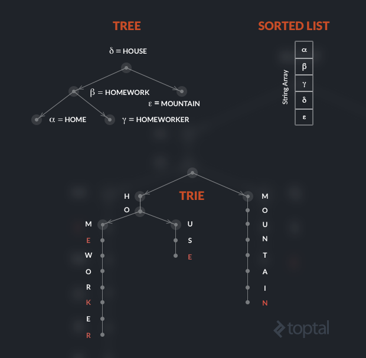

# Trie

## What is a Trie?

First off, a trie is a tree. Pronounced 'try' like in it being an efficient information re *trie* val data structure.

It is a kind of search tree; an ordered tree data structure where the keys are usually strings.

How does it differ from a binary search tree?

  Unlike a binary search tree, no node in the tree stores the key associate with that node; instead, its position in the tree defines they key with which it is associated.

To visualize the difference, let’s consider a small dictionary made of five words. Assume that the Greek letters indicate pointers, and note that in the trie, red characters indicate nodes holding valid words.

### Implementation

As we know, in the tree the pointers to the children elements are usually implemented with a left and right variable, because the maximum fan-out is fixed at two.

In a trie indexing an alphabet of 26 letters, each node has 26 possible children and, therefore, 26 possible pointers. Each node thus features an array of 26 (pointers to) sub-trees, where each value could either be null (if there is no such child) or another node.

### Analyzing Performance

Trie specializes in certain situations.
The cost of looking up a word or prefix is fixed and dependent only on the number of characters in the word and not on the size of the vocabulary.

This does mean, a trie will usually require more memory than a tree or array.

However, when specific domain characteristics apply, like a limited alphabet and high redundancy in the first part of the strings, it can be very effective in addressing performance optimization.

#### Sample problem that uses a Trie data structure solution

[Million Gazillion][million-gazillion]

Try some more Trie problems from [Hackerrank](https://www.hackerrank.com/domains/data-structures/trie)

<!-- Links -->
[million-gazillion]: ./million-gazillion/README.md
